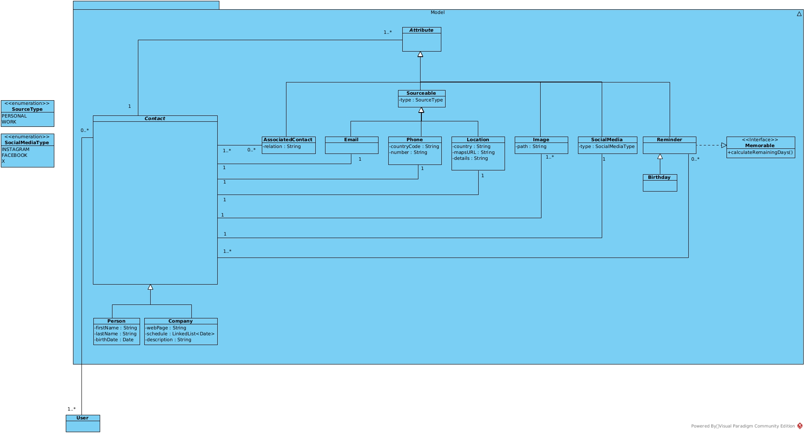

# Class Model

# Draft
Clase Contact 
Atributos: associatedNumbers, phoneNumbers, userName, images, email, location, socialMediaList
Tipos de dato: List<associatedContact>, List<Phone>, String, List<Image>, Email, Location, List<SocialMedia>
Es abstracto

Clase associatedContact
Atributos: contact, relation
Tipos de dato: Contact, String

Clase Person extends Contact
Atributos: firstName, lastName, birthDate
Tipos de dato: Date, String, 

Class Company extends Contact
Atributos: webPage, notes, schedule, product_catalog
Tipos de dato: String, String, Schedule, ProductCatalog

** Class ProductCatalog

Class Schedule
Atributos: days
Tipos de datos:

Class ScheduleDay
Atributos: day, startHour, endHour
Tipos de Datos: Day, TimeStamp, TimeStamp

Enum Day {MONDAY,...} 

---
Class Phone
Atributos: countryCode, number
Tipos de dato: String, String

Enum phoneType {PERSONAL, WORK}
 
---

----
Clase Email
Atributos: emailType
Tipos de dato: EmailType
 
Enum EmailType
----

----
Clase Location
Atributos: mapsURL, details, Country, type
Tipos de datos: String, String, String, LocationType

Enum LocationType {WORK, HOME}
----

----
Clase Image
Atributos: mapsURL, locationDetail
Tipos de datos: String, String
----

Clase SocialMedia
Atributos: type, userName
Tipos de datos: SocialMediaType, String

Enum SocialMediaType {INSTAGRAM, FACEBOOK, X}

Clase Reminder
Es abstracta

Class Birthday
Implementa Memorable
Extiende de Reminder

Interfaz Memorable
Tiene métodos: calculateRemainingDays() 

----
Clase User
Atributos: contactList, log_name, password
Tipos de datos: LinkedList<Contact>, String, String

log_name, password (si alcanza el tiempo)
----
- compareTo() 

Cumpleaños
fecha: 30/10/1998
hoy: 30/10/2023

Clase Empresa 
Arreglo de Persona

- Implementar Serializable

Posiblemente imagen por Ruta o por Clase
Interfaz que depende de package utils para modificaciones

Agrego un contacto

Agregar contactos asociados
- Pueda escoger entre mis contactos
- Asigno un relación

LinkedList<Contact>

Un contacto tiene asociado 1..* fotos 

Día v   Hora de entrada v  Hora de salida v

1. Respecto a atributos contenidos, ¿se refiere a contar los atributos, como el size de una lista, implicando que exista un ArrayList<Attribute>?

** Ordenar por ofertas, o precios más baratos, en función del catálogo.

** Instalador

Java Version: 17